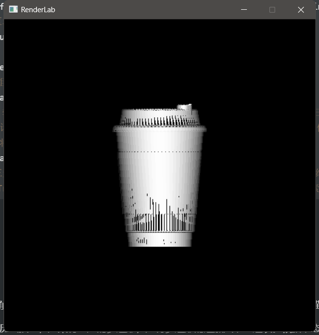
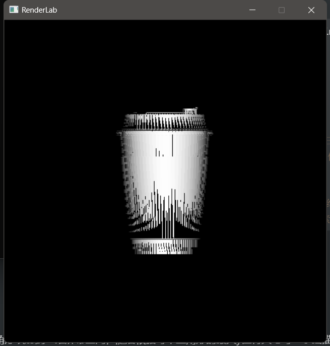

## 介绍

简单的软光栅，实现了下z-buffer

1. 基本z-buffer
2. 扫描线z-buffer

###  1. 基本z-buffer

申请一个和帧缓存同样大小的深度缓存z-buffer。遍历三角网格的每一个面片，绘制像素的时候如果z值大于z-buffer中的值，则更新z-buffer并绘制。

结构如下

```c++
BaseZbuffer::BaseZbuffer(int w, int h, unsigned char* fb, Color back_color) : Painter(w, h, fb, back_color)
    //创建大小与缓冲区相同的zbuffer
BaseZbuffer::~BaseZbuffer()
    //析构函数
void BaseZbuffer::clearZbuffer()
    //清空 zbuffer数组，将所有像素点的深度值重置为负无穷
void BaseZbuffer::drawTriangle(Vec2i* vis, float* Z, Color color)
    //绘制一个三角形，输入参数包括三个顶点的屏幕坐标、深度值以及颜色。首先根据 y 坐标对三个顶点进行排序，然后将三角形分成两个部分，分别处理。在处理每个部分时，首先计算出每个像素点的深度值，然后将该像素点的深度值与 zbuffer中的深度值进行比较，如果该像素点的深度值更小，则更新 zbuffer中该像素点的深度值，并将该像素点的颜色设置为输入参数中的颜色。
void BaseZbuffer::drawMesh(std::vector<TriMesh*>& triMeshs)
    //绘制一个由多个三角形面组成的模型，其中 TriMesh 类包含了该模型的三角形网格信息。在绘制每个三角形面时，首先根据每个三角形的法向量计算出光照强度，然后利用 drawTriangle 函数将该三角形渲染到帧缓冲区中，并使用光照强度计算每个像素点的颜色。
```

效果图如下



### 2.扫描线z-buffer

首先建立多边形表。将三角形映射到二维屏幕空间，随后根据每个三角形的最大y值将其与每一条扫描线对应。

接下来按照y值从大到小遍历扫描线，如果有对应的多边形，则将多边形的边加入动态边表。根据动态边表绘制扫描线的每一个像素。每次到下一条扫描线时，要更新动态边表中的y值和z值，如果y小于0，则删除动态边表对。

结构大差不差

效果图如下

